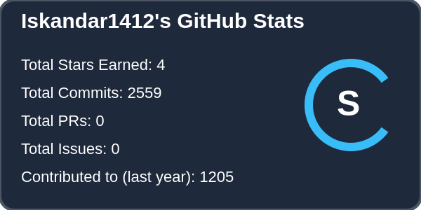
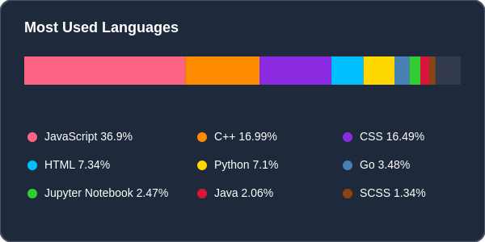
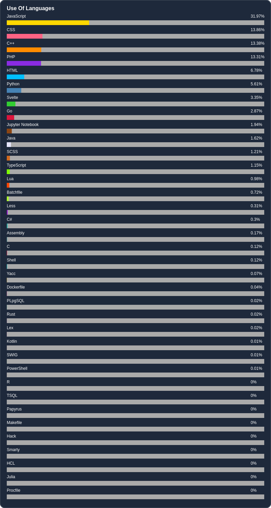

# 💫 About Me:
Hello there! 👋 I'm Iskandar, a dedicated engineering student majoring in Computer Science and Systems Engineering at the University of San Carlos of Guatemala. I have a fervent passion for delving into the world of technology and solving intricate problems. My academic journey has been focused on harnessing the power of various programming languages and crafting innovative solutions.  - 📚 Currently pursuing my degree in Computer Science and Systems Engineering at the University of San Carlos of Guatemala. - 💡 Eager to continuously enhance my skills in languages like Python, Java, JavaScript, and I've dabbled in Kotlin, Golang, and TypeScript. - 💻 Enthusiastically engaged in honing my abilities through hands-on projects, where I refine my software development, system design, and algorithmic prowess. - 🚀 Committed to exploring new vistas in the tech realm and staying updated with the latest industry trends and advancements. - 🌐 Firm believer in the potential of technology to drive positive change and improve the world we live in.

## 💻 Tech Stack:

             

<!-- ## 📊 GitHub Stats: -->
<!-- LANGUAGES-START -->
<table align="center">
  <tr>
    <td align="center">
      
    </td>
    <td align="center">
      
    </td>
  </tr>
</table>

---

## 📊 Lenguajes Usados

<!-- Última actualización: 2025-02-01 00:20:02 UTC -->
<!-- LANGUAGES-END -->
------
